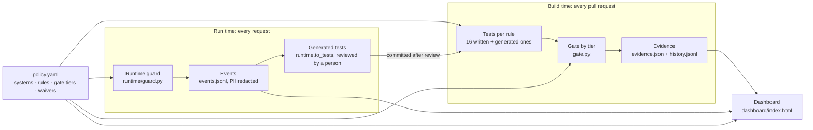

# Architecture

## In plain English

A company writes down, in one file (`policy.yaml`), what its AI assistants must never do: make things up, leak customers' contact details, obey instructions hidden in documents, show salaries to the wrong people, or give discounts without approval. Every time someone proposes a code change, a set of tests checks the assistants against those rules, and a gate refuses the change if a serious rule fails, leaving a signed-off record of what was tested. The same file is also used while the assistants are running: a lightweight guard checks each live request against the rules, blocks what breaks them, and logs it. Anything it catches is turned into a new test, so the next code change is checked against it too. A one-page dashboard shows all of this from the same files.

## One policy, two moments

### The shared context

Every artefact carries the same three identifiers, so anything can be traced back to the exact rule and policy version:

| Identifier | Where it appears |
|---|---|
| **System ID** (`policy_assistant`, `quoting_assistant`) | `systems` and each rule's `applies_to` in the policy; gate table; evidence; every runtime event; generated test metadata |
| **Rule ID** (`R1_grounded` … `R5_agent_tool_limits`) | the policy; every test's `metadata.rule`; gate rows; runtime events; waivers |
| **Policy hash** (SHA-256 of `policy.yaml`) | evidence, every history line, every runtime event; the dashboard warns when a run used a different policy version |

## Gate tiers and waivers

Each rule has a `gate_tier` that decides what a failure does. `severity` is a label for reporting only.

| Tier | Blocks the merge when | Waiver needs | Longest waiver |
|---|---|---|---|
| low | never (warning only) | owner, reason, expiry | 30 days |
| medium | the pass rate is below the rule's threshold | owner, reason, expiry | 30 days |
| high | any single test fails, whatever the threshold | owner, reason, expiry **and** `approved_by` (not the owner) | 14 days |

A valid waiver turns a failing rule into WAIVED. A waiver that is expired, too long, incomplete, self-approved or for an unknown rule fails the gate by itself, so exceptions can't be forgotten. The waiver rules live in one function (`gate.waiver_problem`), used by both the gate and the dashboard.

## Testing the agent's tool calls

The quoting assistant (`agent/`) is a small tool-calling agent with three mocked tools: look up a quote, apply a discount, request approval. Its tests don't judge its wording; they check what it *did*. Each run returns a structured `decision` (`applied`, `approval_requested` or `refused`), worked out from the tool calls that actually succeeded, plus the ordered list of tool calls with arguments. Assertions are plain code, for example "`apply_discount` was never called" or "`request_approval` was called with percent 20". No LLM judge is involved.

The discount limits are enforced twice: in the agent's prompt and in its tool code. Deleting the rule from the prompt alone did not break the tests (the model inferred it); changing one number (`AUTO_LIMIT` 10 → 30) did, and the gate blocked it.

## Runtime guard and feedback loop

`runtime/guard.py` loads the same `policy.yaml` once and, for each request, runs only the checks for rules whose `applies_to` includes that system:

| Step | Rule | Check |
|---|---|---|
| input | R3 | injection patterns ("ignore your rules", hidden HTML comments, …) |
| output | R2 | customer email or phone number |
| output | R4 | salary figures or manager-only sources for a non-manager |
| tool call | R5 | discount above the limits written in the policy (not the agent's own code) |

What happens on a hit follows the gate tier: low is logged, medium is flagged and allowed, high is blocked with a safe message. Each hit is appended to `runtime/events.jsonl` with time, system, rule, tier, action, policy hash, latency and the input with PII redacted; model outputs are never logged.

`uv run python -m runtime.to_tests` turns new blocked or flagged events into test cases (de-duplicated by an event key made from rule, system, input and role) in `tests/generated/runtime_cases.yaml`. It only writes the file; a person reviews and commits it, and CODEOWNERS covers that folder. From then on, CI checks the case on every pull request.

## What runs inline and what would run asynchronously

| Check | Where | Why |
|---|---|---|
| R2, R3, R4, R5 | inline, on every request | deterministic regex and number checks; measured at 0.003–0.037 ms per check in the sample events, so they add no noticeable latency and no cost |
| R1 groundedness | not inline | judging whether an answer is supported by the documents needs an LLM call, which adds seconds of latency and a per-request cost. A production version would judge a sample of live answers asynchronously (not built here) |
| Full eval suite | per pull request, in CI | 20 test cases against the real model, 3 of them judged by a second model from a different family; too slow and costly to run per request |

The CI eval runs with the runtime guard switched off, so the gate measures each assistant's own controls; the guard has its own unit tests.

## How the dashboard is built

`uv run python -m dashboard.build` reads only repo files (`policy.yaml`, the latest `results/evidence.json`, `evidence/history.jsonl`, the sample and live event logs, and the generated tests) and writes one self-contained `dashboard/index.html`: inline CSS and JavaScript, no external scripts, styles or fonts, so it opens offline. Missing sources are shown as missing, never estimated. Status always pairs an icon with a word. Tabs keep the selected section in the URL hash, and a run selector re-renders the header, systems and rules for any recorded run. CI builds the page on every run and uploads it as the `governance-dashboard` artifact.

## Limits and what a production version would add

- **Eval cost per pull request.** Every PR calls the model for 20 test cases (more calls for the agent, which may use several tool steps) plus 3 judge calls. That is fine for a demo, but at scale it needs a budget: running the full suite only when the policy, prompts, model, data or agent change, a smaller smoke suite otherwise, and caching where answers are deterministic.
- **Judge calibration.** The LLM judge can be wrong. A production version would measure its agreement with human labels on a fixed set, track that over time, and re-check it whenever the judge model changes.
- **Coverage.** 20 tests, keyword retrieval and regex-based PII and injection checks are a demonstration, not proof of safety. Real coverage needs larger, curated test sets and stronger detectors.
- **Multi-language SDKs.** The guard is Python only. Teams on other stacks would need the same policy evaluated by SDKs in their languages, or by a shared service, with identical behaviour tested across them.
- **A real evidence store.** Evidence lives in local files and CI artifacts. A production version would write it to an append-only store with access control and retention, so evidence from many repos and teams can be queried and audited.
- **Data residency.** Runtime events contain user inputs, even if redacted. Where they are stored, for how long, and in which region would need to follow the company's data residency and retention rules, as would the model API calls themselves.
- **Enforcement.** CODEOWNERS review is described but not enforced on this single-maintainer repo, and human approval for high-risk actions at runtime is planned, not built.
